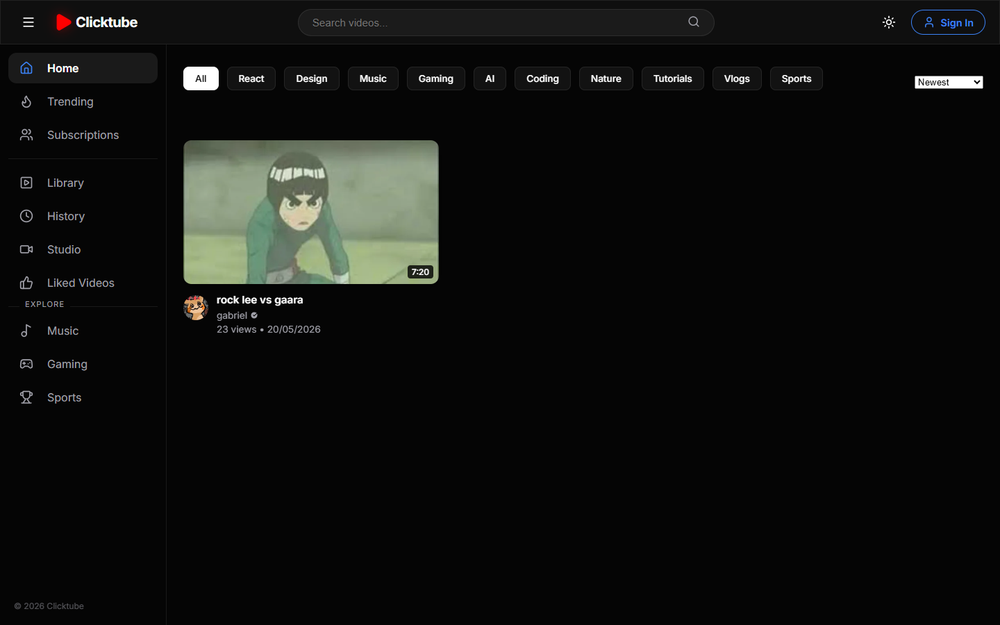
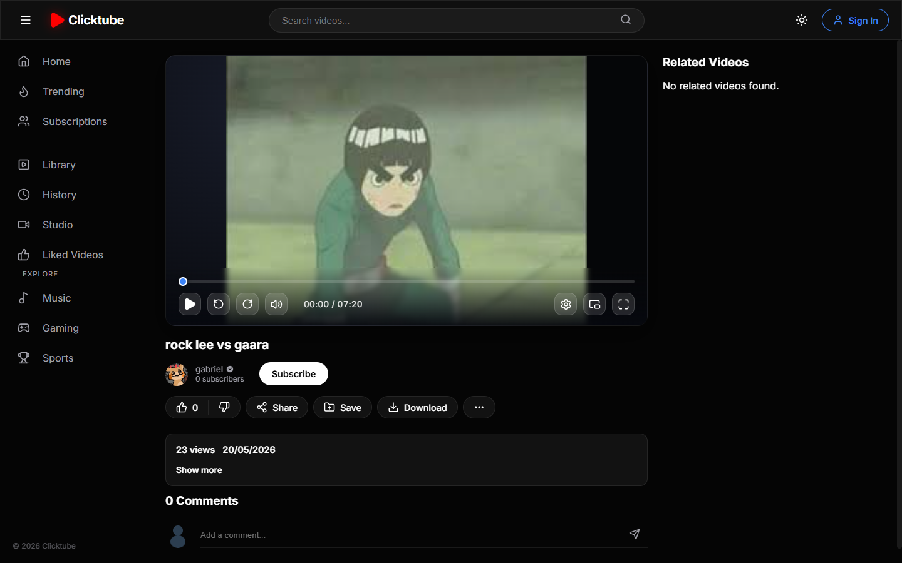
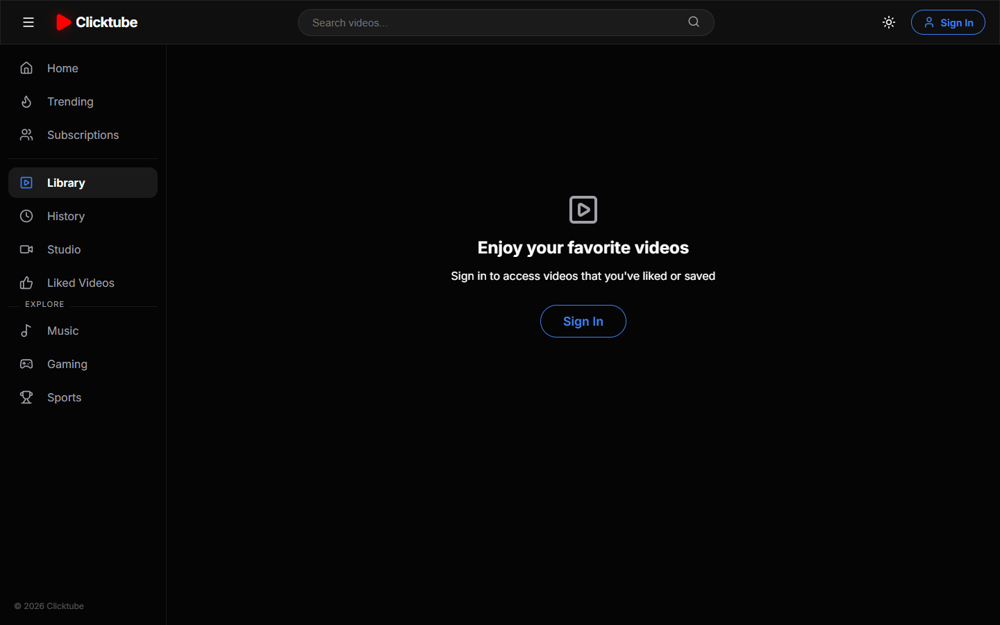
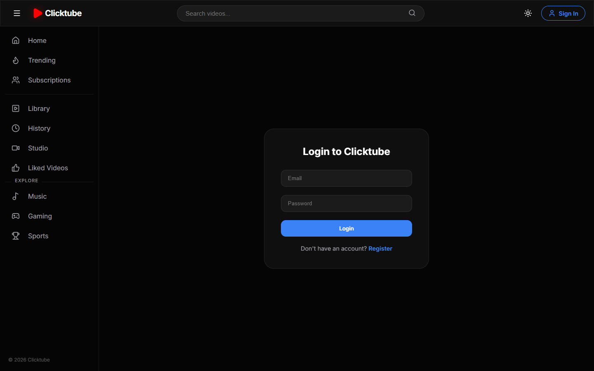

<div align="center">

# ▶️ Clicktube

**Uma plataforma moderna de compartilhamento e streaming de vídeos inspirada no YouTube.**

Construída de ponta a ponta com a stack MERN, foco em performance extrema, streaming sob demanda com pré-carregamento, arquitetura modular e experiência de usuário premium em modo escuro.

[](https://clicktubeapp.vercel.app)
[](https://clicktube-api.onrender.com/health)
[](https://react.dev)
[](https://nodejs.org)
[](https://mongodb.com)

[🚀 Acessar Aplicação Live](https://clicktubeapp.vercel.app) • [📡 Health Check da API](https://clicktube-api.onrender.com/health) • [🐛 Reportar Bug](https://github.com/ryuclover/Clicktube/issues)

</div>

---

## 📸 Demonstração Visual

### 🏠 Feed Principal & Descoberta
Feed dinâmico com rolagem infinita nativa, filtros instantâneos por categoria em cache e busca em tempo real com sugestões automáticas.

<div align="center">
  
</div>

<br />

### 🎬 Player Customizado Pro
Player de vídeo de alto nível com início instantâneo (`preload="auto"`), barra de buffer visual, duplo clique para pular ±10s, atalhos completos do YouTube e Picture-in-Picture.

<div align="center">
  
</div>

<br />

### 📚 Biblioteca & Autenticação
Experiência fluida para visitantes e usuários logados, com suporte a cookies httpOnly seguros e navegação sem bloqueios.

<div align="center">
  
  
</div>

---

## ✨ Principais Funcionalidades

### 🎥 Player de Vídeo Avançado
- **Início Instantâneo (Buffer Warming):** Pré-carregamento com `preload="auto"` para que o vídeo inicie imediatamente ao pressionar Play.
- **Barra de Buffer em Tempo Real:** Visualização em camada do que já foi baixado na memória.
- **Feedback Tátil & Duplo Clique:**
  - Duplo clique no lado esquerdo: retrocede 10 segundos com animação `« -10s`.
  - Duplo clique no lado direito: avança 10 segundos com animação `+10s »`.
  - Clique central com splash pulsante de Play/Pause.
- **Tooltip de Tempo:** Pré-visualização do tempo (`mm:ss`) ao passar o mouse sobre a barra de progresso.
- **Picture-in-Picture (PiP):** Continue assistindo em segundo plano enquanto navega por outras abas.
- **Atalhos de Teclado (Padrão YouTube):** `Espaço` / `K` (Play/Pause), `F` (Fullscreen), `M` (Mudo), `J` / `L` (±10s), `Setas` (±5s e Volume) e `0-9` (pular para 0% a 90%).
- **Persistência de Volume:** Volume e estado de áudio salvos no `localStorage`.

### ⚡ Performance & UX
- **Infinite Scroll Nativo:** Utilização da Web API `IntersectionObserver` com margem antecipada (`rootMargin: 350px`) para carregar novos vídeos suavemente sem congelar a página.
- **Cache Client-Side com TTL:** Mudança instantânea entre categorias e feeds sem refetching repetido nem spinners de carregamento.
- **Navegação Livre para Visitantes:** Visitantes podem assistir, explorar categorias e buscar canais sem qualquer redirecionamento forçado para a tela de login.
- **Design Glassmorphism Premium:** Interface em tons escuros refinados com suporte a responsividade total (Mobile, Tablet e Desktop).

### 🔒 Backend Robusto & Segurança
- **Arquitetura em Controllers (MVC):** Separação clara entre declaração de rotas, validações e regras de negócio (`videoController`, `authController`, `socialController`).
- **Autenticação Segura via Cookies httpOnly:** Tokens JWT gerenciados com flags de segurança `SameSite: None` e `Secure`, garantindo comunicação cross-origin entre Vercel e Render.
- **Sanitização de Consultas:** Proteção contra NoSQL Injection e sanitização de regex em buscas.
- **Upload na Nuvem:** Integração direta com **Cloudinary** para upload de vídeos em HD e otimização de miniaturas.

---

## 🛠️ Tecnologias Utilizadas

| Camada | Ferramentas |
| :--- | :--- |
| **Frontend** | React 18, Vite, React Router DOM, Lucide Icons, React Helmet Async, React Hot Toast |
| **Estilização** | Vanilla CSS moderno, Glassmorphism, CSS Grid, Flexbox, Keyframe Animations |
| **Backend** | Node.js, Express.js, Express Validator, Bcrypt.js, JsonWebToken, Cookie-Parser |
| **Banco de Dados** | MongoDB Atlas, Mongoose ODM |
| **Mídia & Nuvem** | Cloudinary API, Multer Cloudinary Storage |
| **Deploy & CI/CD** | Vercel (Frontend SPA), Render (API Web Service), GitHub Actions |

---

## 📁 Estrutura do Projeto

```bash
Clicktube/
├── screenshots/             # Capturas de tela do aplicativo
│   ├── home.png
│   ├── video_player.png
│   ├── library.png
│   └── login.png
├── server/                  # Backend Node.js & Express
│   ├── config/              # Configurações de banco, Cloudinary e tokens
│   ├── controllers/         # Lógica de negócio (video, auth, social)
│   ├── middleware/          # Autenticação JWT, upload e sanitização
│   ├── models/              # Schemas do Mongoose (User, Video, Like, Comment, etc.)
│   ├── routes/              # Roteadores declarativos da API REST
│   ├── utils/               # Formatadores e helpers
│   └── index.js             # Entrada do servidor Express
├── src/                     # Frontend React & Vite
│   ├── api/                 # Cliente centralizado Axios com interceptors
│   ├── components/          # Componentes reutilizáveis (CustomPlayer, Navbar, etc.)
│   ├── context/             # Gerenciamento de estado global (AuthContext)
│   ├── pages/               # Páginas da aplicação (Home, VideoDetail, Studio, etc.)
│   ├── utils/               # Cache em memória, categorias e helpers
│   ├── App.jsx              # Rotas e layout principal
│   └── main.jsx             # Ponto de entrada React
└── package.json
```

---

## 🚀 Como Executar Localmente

### Pré-requisitos
- Node.js 18+ instalado
- Conta no MongoDB Atlas (ou MongoDB local)
- Conta no Cloudinary para credenciais de mídia

### 1. Clonar o Repositório
```bash
git clone https://github.com/ryuclover/Clicktube.git
cd Clicktube
```

### 2. Configurar o Backend
Crie o arquivo `.env` dentro da pasta `server/` baseado no `.env.example`:
```bash
cd server
cp .env.example .env
```
Preencha as variáveis de ambiente:
```env
PORT=5000
MONGODB_URI=seu_mongodb_uri
JWT_SECRET=seu_jwt_secret
CLOUDINARY_CLOUD_NAME=seu_cloud_name
CLOUDINARY_API_KEY=sua_api_key
CLOUDINARY_API_SECRET=sua_api_secret
FRONTEND_URL=http://localhost:5173
```
Instale as dependências e inicie o servidor:
```bash
npm install
npm run dev
```

### 3. Configurar o Frontend
Em um novo terminal, na raiz do projeto:
```bash
npm install
npm run dev
```
Acesse a aplicação em `http://localhost:5173`.

---

## 📡 Principais Endpoints da API

| Método | Endpoint | Descrição | Acesso |
| :--- | :--- | :--- | :--- |
| `GET` | `/api/videos` | Lista vídeos com paginação e filtro | Público |
| `GET` | `/api/videos/:id` | Retorna metadados e estatísticas do vídeo | Público |
| `POST` | `/api/videos/upload` | Envia vídeo e miniatura para o Cloudinary | Privado |
| `POST` | `/api/auth/register` | Cria novo usuário e define cookies JWT | Público |
| `POST` | `/api/auth/login` | Autentica e inicia sessão | Público |
| `GET` | `/api/auth/me` | Sincroniza sessão ativa do usuário | Privado |
| `POST` | `/api/social/comment` | Adiciona comentário em um vídeo | Privado |
| `POST` | `/api/social/like` | Alterna curtida/descurtida | Privado |
| `POST` | `/api/social/subscribe` | Inscreve ou desinscreve em um canal | Privado |
| `GET` | `/health` | Status operacional e integridade do banco | Público |

---

## 👤 Autor

Desenvolvido com dedicação por **Gabriel** ([@ryuclover](https://github.com/ryuclover)).

Se este projeto foi útil ou inspirador para você, deixe uma ⭐️ no repositório!
